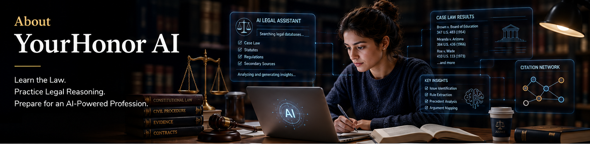

# ⚖️ YourHonor AI

## Learn the Law. Practice Legal Reasoning. Prepare for an AI-Powered Profession.

------------------------------------------------------------------------

Welcome to **YourHonor AI**.

The legal industry today is evolving fast, and AI is making a real difference in everyday legal work. By automating repetitive tasks and improving precision, Al lets legal teams focus more on strategic, impactful activities.

YourHonor AI is an interactive learning platform designed for **law
students, paralegals, and anyone interested in understanding the law**.
Instead of only reading legal concepts, you learn how to use AI tools by exploring cases, analyzing arguments, practicing legal writing, and discovering how artificial intelligence is transforming the legal profession.

Whether you are preparing for class, reviewing for exams, developing
legal research skills, or exploring a new area of law, YourHonor AI
provides a practical environment where you can learn, experiment, and
build confidence at your own pace.

------------------------------------------------------------------------

## 🎯 Why We Built YourHonor AI

Law school teaches students **how to think like lawyers**.

The modern legal profession also requires an understanding of **how
technology---especially artificial intelligence---can support legal
work**.

Courts, law firms, legal publishers, and corporate legal departments are
increasingly exploring AI for legal research, document review, drafting
assistance, and information analysis. Developing these skills today can
help future legal professionals enter a changing profession with greater
confidence.

Our mission is simple:

> **Help learners become stronger legal thinkers by combining
> traditional legal education with modern AI-powered learning tools.**

Everything on this platform is built around one belief:

> **The best way to learn how to use artificial intelligence in law is by actively working with it.**

------------------------------------------------------------------------

## ⚙️ How YourHonor AI Works

YourHonor AI is designed to make legal learning more interactive and
practical.

When you use the platform's learning tools, YourHonor AI helps you:

1.  Explore relevant legal materials, including cases, statutes, legal
    concepts, templates, and educational resources.
2.  Organize complex information into structured explanations.
3.  Practice legal analysis through guided exercises and AI-assisted
    learning tools.
4.  Develop research, reasoning, and writing skills through hands-on
    practice.

The goal is not to replace traditional legal research or professional
judgment.

The goal is to help you **understand legal concepts faster, practice
legal reasoning more often, and develop confidence in your analytical
skills.**

------------------------------------------------------------------------

## 📚 What You Can Do With YourHonor AI

### 📝 Legal Drafting

Four drafting tools under one tabbed view:
- **Case Briefs** — structured briefs covering Facts, Procedural History,
  Legal Issues, Holdings, Court Reasoning, and Key Takeaways.
- **Legal Summaries** — transform lengthy legal materials into concise,
  understandable explanations.
- **Argument Analysis** — identify, organize, and compare legal arguments
  from cases, articles, and other legal sources.
- **Memorandum Generator** — practice creating structured legal memoranda
  using the **IRAC** framework.

### 🔗 Citations

Map cited authorities, statutes, and constitutional provisions to see how
courts interpret, apply, and distinguish legal precedents — and reformat
raw citations into proper **Bluebook** style with rule references and
confidence ratings.

### 🎯 Issue Spotter

Uncover the legal issues a court would examine in any scenario — from
jurisdiction and procedure to damages — with precedent-backed analysis
grounded in landmark case law.

### 🧭 Doctrine Explorer

Browse **70 landmark cases** across **30+ doctrines** with an interactive
timeline and subject filters, compare any two cases side by side, and
generate case briefs directly from doctrine nodes.

### 🗣️ Debate Analysis

Explore multiple perspectives on legal issues by examining competing
arguments and counterarguments.

### 📘 Legal Glossary

Build your legal vocabulary with more than **120 legal terms** explained
in plain English.

### 🎓 AI Tutor

Learn through guided conversations with an AI tutor, flashcards, review
sessions, and practice questions.

### 📑 Document Generator

AI streamlines legal document processing by automating data extraction and summarization, improving accuracy, accessibility, and efficiency while reducing manual review.

Practice drafting legal documents using **24 professionally structured
templates**.

### 📊 Study Dashboard

Track your documents by type, notes, and AI Tutor review progress in one
overview — with weakest-topic identification, completed live tutor
session accuracy, and an account-age timeline.

### 💬 AI Chat Assistant

Ask questions in natural language and receive guidance on legal concepts
and study approaches.

------------------------------------------------------------------------

## 🌟 Our Principles

### Learning is Active

True understanding comes from applying legal concepts to realistic
situations.

### Evidence Matters

Good legal reasoning begins with reliable sources.

### AI is Your Assistant

AI supports research and learning, but it never replaces legal judgment,
ethics, or critical thinking.

### Curiosity is a Strength

Every lawyer begins by asking questions.

------------------------------------------------------------------------

## 🚀 Looking Ahead

Artificial intelligence is changing legal practice, but the foundations
of good lawyering remain unchanged: careful research, sound judgment,
ethical responsibility, clear reasoning, and effective communication.

> **The lawyers of tomorrow will not only understand the law---they will
> know how to work alongside intelligent technology.**

------------------------------------------------------------------------

## 🆕 What's New in v1.4.0

- **Doctrine Explorer** — browse 31 doctrines across 70 landmark cases
  with an interactive timeline, subject filters, and one-click case brief
  generation from any case node.
- **Expanded Resources** — new *Understanding AI in Law* explainers on
  **Predictive Analytics** and **Legal Reasoning Graphs**, covering how
  each is used in the legal system and its limitations.
- **Scanned PDF support** — uploaded scanned documents are now read with
  OCR (tesseract) when no embedded text is found.
- **More reliable landmark library** — the Penn Central opinion now always
  resolves to its full text, and update checks are cached so the app
  doesn't hit the GitHub API on every page load.

------------------------------------------------------------------------

## ⚠️ Educational Use Only

YourHonor AI is an **educational platform** and is **not** a law firm or
a substitute for professional legal advice.

AI-generated content should be verified using primary legal authorities,
official publications, and course materials.

**Critical thinking remains your most valuable legal skill.**

------------------------------------------------------------------------

**YourHonor AI**\
*Learn. Research. Practice. Grow.*

